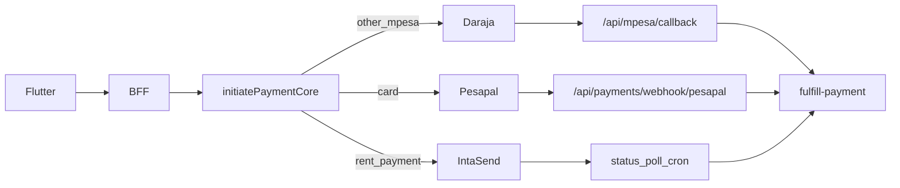

# Payment flow map

## Provider routing (immutable)

## payment_type → purpose

| Type | Typical UX | Provider |
|------|------------|----------|
| `contact_unlock` | Unlock landlord phone | Daraja / card |
| `tenant_plus` | Tenant Plus | Daraja / card |
| `landlord_plan` / `premium_subscription` | Lister plans | Daraja / card |
| `pm_module` | PM subscription | Daraja / card |
| `property_boost` / `featured_listing` | Boosts | Daraja / card |
| `lead_pack` | Lead packs | Daraja / card |
| `verification` | Paid property check | Daraja / card |
| `provider_subscription` | Provider tiers | Daraja / card |
| `rent_payment` | Tenant/PM rent | **IntaSend only** |
| `report` / `invoice` | Reports / advertise | Daraja / card |

## Flutter rules

1. Call BFF to initiate; show STK wait UI; poll `GET /payments/:id`.  
2. Never write `contact_unlocks` / subscriptions / pm payment rows from the client.  
3. Do not change webhook routes or fulfillment switch.  
4. Card: open Pesapal redirect URL (external browser / Custom Tabs) then poll/status return.

## Already working in Flutter

Contact unlock → Daraja STK → poll → reveal phones.
